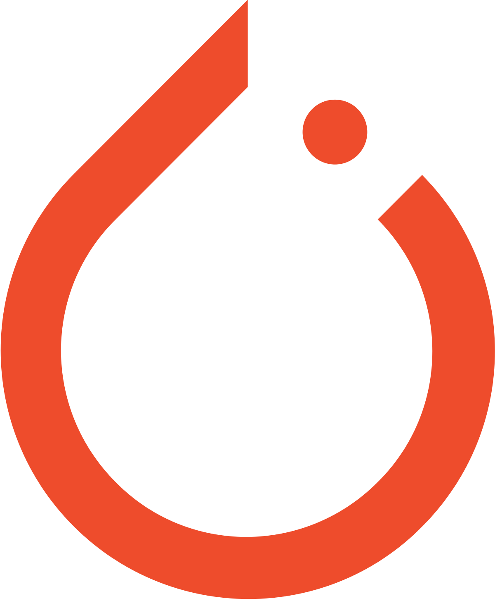

# University Material 
Subset of university course material from my B. Eng Software Engineering at Carleton University. 
## Programming Courses
| Course | Programming Language | 
| ------ | -------------------- |
|[COMP 4102: Computer Vision](https://github.com/va9id/computer-vision)|  |
|[SYSC 4810: Network and Software Security](https://github.com/va9id/sysc4810)||
|[SYSC 4806: Software Engineering Lab](https://github.com/va9id/sysc4806) + [Project](https://github.com/va9id/SYSC4806Project)||
|[COMP 3005: Database Management Systems](/courses/COMP3005/)| |
|[SYSC 3101: Programming Languages](/courses/SYSC3101/)| |
|[SYSC 3303: Real Time Concurrent Systems](https://github.com/va9id/concurrent-systems) + [Project](https://github.com/va9id/elevator-simulator)||
|[SYSC 4504: Fundamentals of Web Developement](/courses/SYSC4504/)|    |
|[SYSC 4001: Operating Systems](https://github.com/va9id/operating-systems)||
|[SYSC 3310: Intro to Real Time Systems](/courses/SYSC3310/)||
|[SYSC 3110: Software Design Project](https://github.com/va9id/monopoly)||
|[ECOR 1041: Computation and Programming (Project)](https://github.com/va9id/cli-image-editor)||
## Other Courses
| Course | Content |
| ------ | ------- |
|[SYSC 4120: Software Architecture](/courses/SYSC4120/)|[Midterm](/courses/SYSC4120/midterm.pdf), [Labs](/courses/SYSC4120/labs/)|
|[SYSC 4106: Software Economy and Project Management](/courses/SYSC4106/)|[Case studies](/courses/SYSC4106/case-studies/), [Midterm](/courses/SYSC4106/midterm.pdf), [Tutorials](/courses/SYSC4106/tutorials/) |
