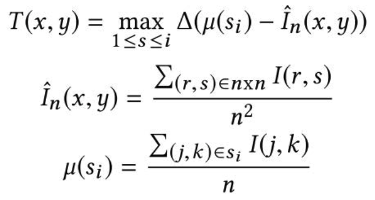

# Edge Detection
This repository contains the code for assignment 1 of computer vision COMP 4102.
## Requirements
- [NumPy](https://numpy.org/install/)
- [OpenCV](https://pypi.org/project/opencv-python/)
- [matplotlib](https://matplotlib.org/stable/users/installing/index.html)
- [scikit-image](https://scikit-image.org/docs/stable/user_guide/install.html)
## Canny Edge Detection 
Implement the Canny Edge detector and find the optimal parameters of the Canny detector including the Gaussian smoothing parameter and the hysteresis thresholding parameters. Compare the results to the provided Sobel Edge detection. 
## Stick Filters
Apply sticks filtering on gradient magnitude image using *n*=5 and *i*=8 sticks orientations to enhance the edge segments before applying non-maxima suppression. 

Stick maps can be created using the following equations where *n* is the length of each stick *i*: 

