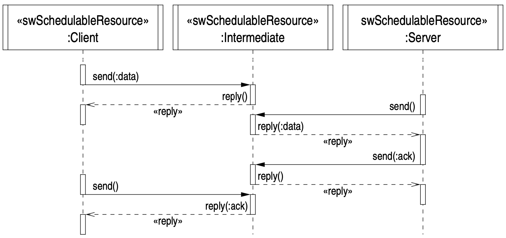

# Assignment 3 - Remote Procedure Calls

## Problem Statement

Use remote procedure calls to transfer data from the client to the server using the intermediate host. The following sequence diagram shows how a basic write request takes place:

The algorithm is exactly the same as assignment2. However, the Client will now wait for the Intermediate task to accept the data and then reply rather than continuing on to wait for the acknowledgement packet directly.

## Usage

Open the project in IntelliJ and run each file in the following order:

1. `Intermediate.java`
2. `Client.java`
3. `Server.java`

*Note:* Multiple clients can be run in seperate terminals.