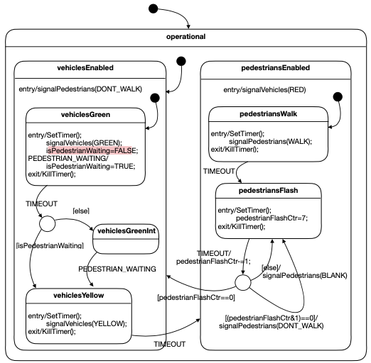

# Assignment 4 - State Machines

## Problem Statement

Recreate the following state machine shown in the diagram below: 

- There are two events: TIMEOUT and PEDESTRIAN_WAITING 
  - `TIMEOUT` events are to be started by your code from your state machine
  - `PEDESTRIAN_WAITING` events are called from `Main.java`
- Timeout durations: 
  - GREEN to YELLOW = **10s** 
  - YELLOW to RED = **3s**
  - WALK = **15s**
  - FLASH = alternate every **1** between ON and OFF
    - Alternate based on if `pedestrianFlashCtr` is even/ON or odd/OFF 

## Errors

There are two errors in the given state machine diagram that are addressed in my implementation: 
1. `pedestrianFlashCtr` is never decremented past 6, as it re-enters the `pedestriansFlash` state which resets its value back to 7.

2. If a `PEDESTRIAN_WAITING` event occurs in the `pedestriansFlash` state, they must wait for the next occurrence of the `pedestrianWalk` state. Meaning that when the state machine transitions back to the `vehiclesGreen` state it should transition to `vehiclesYellow` state rather than `vehiclesGreenInt` state because a pedestrian is still waiting to cross from the prior `pedestriansFlash` state.  

## Usage

Open the project in IntelliJ and run `Main.java`