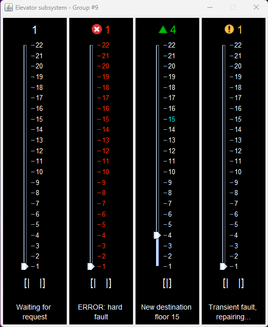

# Elevator Control System and Simulator 
 
## Usage 
- **Prerequisites**: [Java](https://www.java.com/download/ie_manual.jsp) and [Eclipse IDE](https://www.eclipse.org/downloads/packages/)
1. Load the project into Eclipse using the provided zip inside the final submission zip. To do this click the "File" menu in Eclipse then click “Import”, and under the "General" folder select "Project from Folder or Archive". Now select the previously mentioned zip file from your file system and click “Finish”.
2. Once the project is loaded into Eclipse, it can be run by executing the main methods of the following files under the `src` directory and `com.sysc3303.project` package in the **following order**: 
    1. `Scheduler.java` (located in the `com.sysc3303.project.scheduler` package)
    2. `Elevator.java` (located in the `com.sysc3303.project.elevator` package)
    3. `Floor.java` (located in the `com.sysc3303.project.floor` package) 

- The project can be run in that order on either 1 or 3 computers. If running on 3 different computers the IP addresses in Scheduler.java and Floor.java must be set (change the ADDRESS constants) to the corresponding computer's IP address. To get the IP address of the computer run the following commands:

  - **Windows:** get the Ipv4 address
    ```
    ipconfig /all 
    ```
  - **Mac:**
    ```
    curl ifconfig.me
    ```

3. Once the project has been run, you should see output in the console and a GUI will appear corresponding to the events sent and received by the Elevator, Scheduler, and Floor subsystems.

### Tests
1. Follow the [previous steps](#eclipse) to set up the project in Eclipse.
2. To run a single test case open the `com.sysc3303.project.test` package in the `src` directory then click on any JUnit Test Class. Now in the Drop down menu select Run > Run As > JUnit Test.
3. Alternatively, all the JUnit Test Classes can be run by right-clicking on the `com.sysc3303.project.test` package and selecting Run As > JUnit Test.

***NOTE:*** If you encounter an error when running the project or the test cases in Eclipse you may need to clean the project by selecting the menu Project > Clean.

## Sample Output


From the above figure from **left to right** (system is set with 4 elevators with 22 floors):
- Elevator is idle and waiting for a request
- Elevator has encountred a hard fault and is out of operation
- Elevator is processing a request and moving up towards the destination floor (highlighted in cyan)
- Elevator has encounted a transient fault and is reparing itself, after which it will continue processing requests

## Error Handling
### Transient Faults 
Transient faults include events such as an elevator door failing to close. These types of faults are repaired and resolved by the elevator. Transient faults are encoded within the Fault column of the `floor_input.txt` as the number 1. Transient faults are shown in the GUI using the following [icon](Resources/images/transientFaultIcon.png).

### Hard Faults 
Hard faults include events such as an elevator loosing power. These types of faults cannot be repaired and cause the elevator to shutdown. Hard faults are encoded within the Fault column of the `floor_input.txt` as the number 2. Hard faults are shown in the GUI using the following [icon](Resources/images/hardFaultIcon.png) and by changing the colour of the elevator that encountered the hard fault to red. 

## Configurations
- The number of elevators that are running can be changed by changing the NUM_CARS constant in `Elevator.java`.
- Adjust the `floor_input.txt` located within the [Resources folder](/Resources/floor_input.txt) to configure the input of system.
  - Adjust the time, floor, floor button, car button and fault
    - 0 = no fault
    - 1 = transient fault
    - 2 = hard fault 