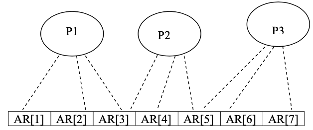

# Assignment 2: Concurrent Sorting with Semaphores

## Problem Statement 

Create a program that sorts an inputted list of 7 characters in lexicographic order. The sorting should be done by 3 processes, who each access 3 indexes of the list. Since multiple processes can read and write into some shared index, semaphores are required to ensure only one process can be in the critical section at one time.




## Usage

- Run the Makefile
    ```
    make
    ```
- Execute the executable
    ```
    ./assignment2
    ```
